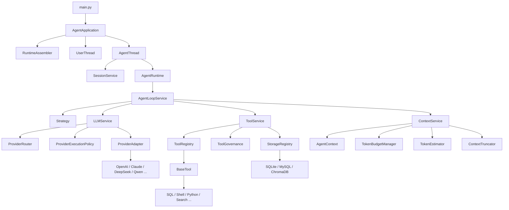

# NanoAgent 完整改造方案

## 1. 目标

本文给出一份基于当前代码实现的完整改造方案，目标是把 NanoAgent 从“可运行的 Agent Runtime”演进为“更接近工业级的 Agent 架构”。

本次改造重点解决以下问题：

- `AgentExecutor` 过重，编排、装配、模型调用策略、上下文管理耦合过深
- `SingleProviderClient` 过薄，`AgentExecutor` 与具体 LLM Provider 之间缺少真正的模型中间层
- 工具执行、上下文裁剪、模型调用、资源治理都缺少更稳定的领域边界
- 现有 tracing、错误处理、失败恢复能力虽已具备雏形，但还没有形成统一的运行时治理体系

---

## 2. 改造原则

### 2.1 核心原则

1. 保留当前已有可运行主链路，不做推倒重写
2. 优先做“职责下沉”和“边界收拢”，不先追求功能堆叠
3. 每一阶段都可独立落地、可回归、可回滚
4. 优先抽离运行时领域服务，再考虑扩展策略和能力中心
5. 所有新抽象都必须服务于当前代码真实痛点，而不是为了抽象而抽象

### 2.2 总体思路

把当前系统从：

`AgentThread -> AgentExecutor -> Strategy / Tools / LLM / Context / Storage`

演进为：

`AgentThread -> AgentRuntime -> AgentLoopService -> LLMService / ToolService / ContextService / SessionService`

其中：

- `AgentLoopService` 只负责 Agent 单轮执行闭环
- `LLMService` 负责模型调用域能力
- `ToolService` 负责工具执行域能力
- `ContextService` 负责上下文预算、裁剪、归档、摘要
- `SessionService` 负责会话生命周期、状态机、运行元数据
- `RuntimeAssembler` 负责对象装配，不参与运行时业务

---

## 3. 目标架构

### 3.1 目标分层

建议调整为 8 层：

1. 启动与装配层
2. 应用线程与交互层
3. Agent Runtime 编排层
4. Agent Loop 执行层
5. LLM 调用服务层
6. Tool 执行服务层
7. Context / Memory 服务层
8. Provider / Tool / Storage 适配层

### 3.2 目标结构图



---

## 4. 当前架构问题与对应改造方向

### 4.1 `AgentExecutor` 过重

当前问题：

- 负责对象构建
- 负责 LLM 调用重试与回退
- 负责 Tool 执行编排
- 负责 Context 管理
- 负责 Storage 绑定
- 负责运行时 reset/release

改造方向：

- 保留一个薄的 `AgentRuntime` 或 `AgentLoopService`
- 将模型调用策略抽到 `LLMService`
- 将工具执行策略抽到 `ToolService`
- 将上下文预算、裁剪、归档抽到 `ContextService`
- 将 provider/tool/storage 的构建移出运行时，交给 `RuntimeAssembler`

### 4.2 `SingleProviderClient` 太薄

当前问题：

- 几乎没有领域能力
- 只是 provider 的轻量包装
- 真正复杂能力都堆在 `AgentExecutor._call_llm()`

改造方向：

- 弃用“薄包装”定位
- 在 `AgentExecutor` 和具体 provider 之间新增 `LLMService`
- `SingleProviderClient` 若保留，应改成更明确的 `ProviderInvoker` 或并入 `LLMService`

### 4.3 对象装配和运行时编排混杂

当前问题：

- `_build_provider()`
- `_build_storage_registry()`
- `_build_tool_registry()`
- `_build_truncator()`

这些都在 `AgentExecutor` 中，导致运行时逻辑和初始化逻辑耦合。

改造方向：

- 新增 `RuntimeAssembler`
- 统一从配置构建 runtime 依赖树
- `AgentExecutor` 不再直接 new provider/tool/storage

### 4.4 工具失败链路不完整

当前问题：

- `ToolResult.success/error` 在用户消息侧是完整的
- 但进入 LLM context 的 `tool` observation metadata 不完整
- 裁剪器中“删除失败 reasoning unit”的策略很难准确命中

改造方向：

- 在 `tool observation` 中标准化保留：
  - `success`
  - `error_code`
  - `error_message`
  - `tool_name`
  - `llm_raw_tool_call_id`
- 为工具结果定义统一的 observation schema

### 4.5 Session 过轻

当前问题：

- `Session` 只有状态，没有运行元数据

改造方向：

- 升级为 `SessionState` + `SessionService`
- 增加：
  - session_id
  - task_id
  - attempt_count
  - active_provider
  - tool_call_count
  - token_usage
  - error_history
  - started_at / finished_at

---

## 5. 新增领域服务设计

### 5.1 `LLMService`

这是本次改造最重要的中间层。

#### 职责

- provider routing
- provider fallback
- retry / backoff
- context window adaptation
- structured error normalization
- parse repair / self-repair
- usage / latency / provider telemetry
- provider capability abstraction
- 统一输出 `LLMResponseEnvelope`

#### 建议接口

```python
class LLMService:
    def generate(self, request: LLMRequest, *, session: SessionState | None = None) -> LLMCallResult:
        ...
```

#### 建议返回对象

```python
@dataclass(slots=True)
class LLMCallResult:
    response: LLMResponse | None
    provider_name: str | None
    usage: dict[str, int]
    attempts: int
    fallback_used: bool
    repaired: bool
    error: AgentError | None
```

#### 需要收拢的能力

- `AgentExecutor._call_llm()` 的全部主逻辑
- `RetryConfig`
- provider context window 适配逻辑
- provider usage 收集逻辑
- error category 到重试/回退动作的映射

### 5.2 `ToolService`

#### 职责

- 查找工具
- 执行工具
- 重试 timeout
- 生成标准化 observation
- 汇总 tool telemetry
- 接入 tool governance

#### 建议接口

```python
class ToolService:
    def execute_calls(self, tool_calls: list[ToolCall]) -> list[ToolExecutionRecord]:
        ...
```

#### 建议返回对象

```python
@dataclass(slots=True)
class ToolExecutionRecord:
    tool_call: ToolCall
    result: ToolResult
    observation: LLMMessage
    latency_ms: int
```

### 5.3 `ContextService`

#### 职责

- 维护 `AgentContext`
- 负责 current task / archived task
- 负责 token budget 分配
- 负责 token estimation
- 负责 context truncation / summarize
- 负责工具 observation 与用户消息追加策略

#### 建议接口

```python
class ContextService:
    def append_user_message(self, msg: UIMessage) -> None: ...
    def append_assistant_message(self, msg: LLMMessage) -> None: ...
    def append_tool_observation(self, msg: LLMMessage) -> None: ...
    def build_request(self, strategy: Strategy, tool_schemas: list[dict]) -> LLMRequest: ...
    def compact_for_provider(self, request: LLMRequest, provider_name: str) -> TruncationResult: ...
```

### 5.4 `SessionService`

#### 职责

- 会话状态机
- attempt 统计
- task 生命周期
- provider / tool 调用统计
- 错误聚合
- trace 边界管理

### 5.5 `RuntimeAssembler`

#### 职责

- 从配置构建运行时依赖图
- 统一创建：
  - LLM providers
  - router
  - services
  - storages
  - tools
  - tracer

这层只负责“装配”，不负责“业务运行”。

---

## 6. 模块改造后的职责边界

### 6.1 `AgentThread`

保留职责：

- 接收用户消息
- 启停 session
- 调用 `AgentRuntime.run_turn(...)`
- 把输出消息转发给 UI

不再负责：

- 判断 LLM 硬错误策略
- 维护复杂运行统计

### 6.2 `AgentRuntime` / `AgentLoopService`

保留职责：

- 驱动单轮 Agent Loop
- 按策略解析：
  - FinalAnswer
  - InvokeTools
  - ResponseTruncated

不再负责：

- provider fallback
- provider retry
- truncation 策略细节
- tool execution retry

### 6.3 `LLM Provider`

保留职责：

- 底层 API 协议适配
- 请求序列化
- 响应反序列化
- provider 原始 usage 抽取

不负责：

- fallback
- retry
- self-repair
- context trim
- 业务级错误决策

---

## 7. 目录改造建议

建议新增如下目录结构：

```text
src/
  agent/
    runtime/
      agent_runtime.py
      agent_loop_service.py
      runtime_models.py
  llm/
    service/
      llm_service.py
      routing_policy.py
      execution_policy.py
      provider_capabilities.py
      models.py
    providers/
      base.py
      openai_api.py
      claude_api.py
      ...
  tools/
    service/
      tool_service.py
      governance.py
      models.py
  context/
    service/
      context_service.py
  session/
    session_state.py
    session_service.py
  bootstrap/
    runtime_assembler.py
```

---

## 8. 分阶段实施方案

### 阶段 0：基线冻结

目标：

- 确保改造前行为可回归

执行项：

1. 补充主链路集成测试
2. 记录当前配置下的执行日志样本
3. 固化以下行为基线：
   - provider fallback
   - tool timeout retry
   - context truncation
   - session reset

验收标准：

- 至少有一组集成测试覆盖“新任务 -> 工具调用 -> 最终答案”
- 至少有一组失败场景覆盖“provider 失败 -> fallback 生效”

### 阶段 1：抽离装配层

目标：

- 让 `AgentExecutor` 不再承担构建职责

执行项：

1. 新增 `RuntimeAssembler`
2. 将以下方法迁移出去：
   - `_build_provider`
   - `_build_llm_provider_router`
   - `_build_storage_registry`
   - `_build_tool_registry`
   - `_build_truncator`
3. `AgentApplication` 通过 assembler 拿到完整 runtime 组件

收益：

- `AgentExecutor` 明显瘦身
- 初始化逻辑更适合测试

### 阶段 2：引入 `LLMService`

目标：

- 建立真正的模型中间层

执行项：

1. 新增 `LLMService`
2. 将 `AgentExecutor._call_llm()` 主逻辑整体迁移到 `LLMService.generate()`
3. 让 `AgentExecutor` 只保留：
   - build request
   - 调用 `LLMService`
   - 处理 strategy decision
4. 弱化或移除 `SingleProviderClient`

建议迁移内容：

- retry/backoff
- fallback
- self-repair
- context too long trimming
- usage/latency logging
- provider 级错误分类

验收标准：

- 外部行为与现有逻辑一致
- `AgentExecutor` 中不再存在复杂 provider 循环和 retry 分支

### 阶段 3：引入 `ToolService`

目标：

- 将工具执行域从 executor 中剥离

执行项：

1. 新增 `ToolService`
2. 将 `ToolRegistry.execute()` 的调用编排、observation 生成、日志统计迁移到 `ToolService`
3. 定义统一 `ToolExecutionRecord`
4. 标准化 tool observation metadata

建议标准 observation metadata：

```python
{
    "tool_name": "...",
    "llm_raw_tool_call_id": "...",
    "success": True,
    "error_code": None,
    "error_message": None,
}
```

验收标准：

- truncator 可以识别失败工具步骤
- UI 输出和 LLM 上下文中的工具结果 schema 一致性增强

### 阶段 4：引入 `ContextService`

目标：

- 把 `AgentContext + truncation + token budget` 聚合成稳定服务

执行项：

1. 新增 `ContextService`
2. 将对 `AgentContext` 的操作封装起来
3. 将 provider-aware truncation 接入 `ContextService`
4. 让 `AgentExecutor` 不再直接操作 `AgentContext`

收益：

- context 生命周期更清晰
- 为将来 memory 分层打基础

### 阶段 5：升级 `Session`

目标：

- 从简单状态对象升级为完整会话运行实体

执行项：

1. 新增 `SessionState`
2. 新增 `SessionService`
3. 在 session 中记录：
   - attempts
   - active provider
   - last tool calls
   - token usage
   - error history
4. tracing 与 session 生命周期绑定

### 阶段 6：治理与观测增强

目标：

- 从“能看日志”升级到“可运营的 runtime telemetry”

执行项：

1. 为 provider 增加成功率、重试次数、fallback 次数统计
2. 为 tool 增加延迟和错误率统计
3. 为 session 增加 summary 输出
4. 统一 runtime events

建议事件模型：

- `session_started`
- `llm_call_started`
- `llm_call_failed`
- `llm_fallback_used`
- `tool_called`
- `tool_failed`
- `context_truncated`
- `session_completed`

---

## 9. 关键类迁移建议

### 9.1 `AgentExecutor` 建议保留内容

- `run()`
- `_execute()` 的高层分支逻辑
- strategy 决策分发

### 9.2 `AgentExecutor` 建议迁出内容

- provider 构建
- tool registry 构建
- storage 构建
- truncator 构建
- `_call_llm()`
- 工具批量执行与 observation 组装
- context 直接读写细节

### 9.3 `SingleProviderClient` 处理建议

有两个可选方案：

方案 A：删除  
如果 `LLMService` 已经承担统一调用职责，那么 `SingleProviderClient` 没有存在必要。

方案 B：重命名为 `ProviderInvoker`  
如果你仍想保留一层轻包装，可以让它承担：

- provider 调用计时
- 统一异常包装
- usage 抽取

推荐方案：`B` 作为过渡，后期视情况并入 `LLMService`。

---

## 10. 新的数据模型建议

### 10.1 LLM 领域模型

```python
@dataclass(slots=True)
class LLMCallContext:
    session_id: str
    task_id: str
    attempt_index: int
    strategy_name: str


@dataclass(slots=True)
class LLMCallResult:
    response: LLMResponse | None
    provider_name: str | None
    finish_reason: str | None
    usage: dict[str, int]
    latency_ms: int
    attempts: int
    fallback_used: bool
    repaired: bool
    error: AgentError | None
```

### 10.2 Tool 领域模型

```python
@dataclass(slots=True)
class ToolExecutionRecord:
    tool_name: str
    arguments: dict[str, Any]
    success: bool
    output: str
    error_code: str | None
    error_message: str | None
    latency_ms: int
```

### 10.3 Session 领域模型

```python
@dataclass(slots=True)
class SessionState:
    session_id: str
    task_id: str
    status: SessionStatus
    attempt_count: int
    tool_call_count: int
    active_provider: str | None
    token_usage: dict[str, int]
    error_history: list[str]
```

---

## 11. 测试改造方案

### 11.1 单元测试新增重点

- `LLMService`：
  - retry
  - fallback
  - repair
  - context too long

- `ToolService`：
  - timeout retry
  - observation schema
  - unknown tool fallback

- `ContextService`：
  - token budget
  - truncation strategy
  - summarize fallback

- `SessionService`：
  - state transition
  - stats accumulation

### 11.2 集成测试新增重点

- 新任务完整闭环
- provider 主链路失败后 fallback 成功
- tool 失败后模型继续规划
- 超长上下文触发裁剪
- 最大轮数结束

---

## 12. 风险与应对

### 风险 1：抽象过快，导致主链路不稳定

应对：

- 先抽装配层，再抽 LLMService
- 每阶段都保持行为兼容

### 风险 2：服务拆分后 tracing 断链

应对：

- 在新服务接口中显式传递 session / trace context

### 风险 3：上下文裁剪行为发生微妙变化

应对：

- 先做 golden test
- 保留旧逻辑对照

### 风险 4：工具 observation schema 改动影响模型行为

应对：

- 分阶段引入 metadata 扩展
- 尽量不改 observation content 主文本

---

## 13. 推荐实施顺序

建议按下面顺序推进，不要并行大改：

1. 基线测试
2. `RuntimeAssembler`
3. `LLMService`
4. `ToolService`
5. `ContextService`
6. `SessionService`
7. telemetry / governance

其中最优先的是：

- `RuntimeAssembler`
- `LLMService`

因为这两步能最快解决当前最大的结构问题。

---

## 14. 第一阶段最小可执行改造包

如果希望先做一版“投入小、收益大”的改造，建议第一批只做以下事项：

1. 新增 `RuntimeAssembler`
2. 新增 `LLMService`
3. 将 `_call_llm()` 从 `AgentExecutor` 移到 `LLMService`
4. 让 `AgentExecutor` 通过依赖注入拿到：
   - `Strategy`
   - `LLMService`
   - `ToolRegistry`
   - `ContextService` 或 `AgentContext`
5. 保留现有 tool registry 和 truncator，不立即大拆

这样能用最小成本完成最重要的一次架构降耦。

---

## 15. 最终落地效果预期

改造完成后，系统应达到以下效果：

- `AgentExecutor` 变成真正的 loop orchestrator，而不是超级中心类
- 模型调用能力收拢到 `LLMService`
- provider adapter 与模型调用策略解耦
- tool execution 与 observation schema 标准化
- context 管理变成独立服务
- session 成为可观测、可统计、可恢复的运行实体
- 后续要加多策略、多模型、多任务并发时，不需要持续膨胀 `AgentExecutor`

---

## 16. 总结

这次改造不建议做“语义上很大、代码上很猛”的重写，而建议采用“围绕领域服务做职责下沉”的方式渐进演进。

最核心的一步是承认：  
`AgentExecutor -> SingleProviderClient -> 具体 Provider` 这条链路里，中间层确实缺失，而且缺失的不是一个简单 wrapper，而是一个真正的模型调用服务层。

因此本方案的中心结论是：

- 要加中间层
- 中间层应该是 `LLMService / ModelGateway`
- 它需要收拢模型调用领域能力，而不是只做转发

如果按本文路径推进，NanoAgent 会从“工程化程度不错的单体 Agent Runtime”，逐步演进成“边界更清晰、治理更完整、可持续扩展的 Agent 平台内核”。

