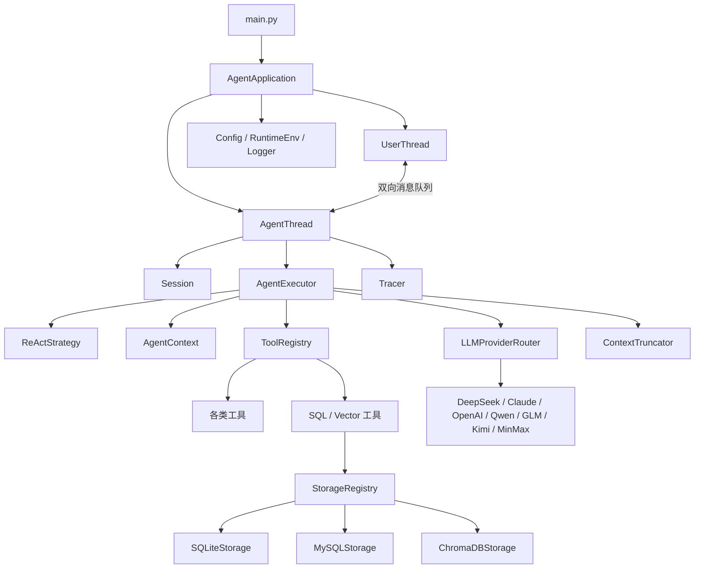

# NanoAgent 项目技术架构文档

## 1. 文档目的

本文基于当前项目代码扫描结果编写，目标是说明：

- 项目的整体架构分层
- 每一层的核心类、隶属关系与调用关系
- 程序从启动到任务完成的核心执行流程
- 系统已经实现的容错、重试、降级与资源保护机制

本文描述的是“当前代码真实实现”，不是理想化设计稿。

---

## 2. 整体架构总览

NanoAgent 是一个以 ReAct Agent 为核心的 Python 多线程任务执行系统。系统的主链路可以概括为：

`main.py -> AgentApplication -> UserThread / AgentThread -> AgentExecutor -> Strategy -> LLM Router -> LLM Provider / ToolRegistry / Storage`

从职责上看，系统可以划分为 7 层：

1. 启动与应用编排层
2. 交互与线程协作层
3. Agent 执行编排层
4. 策略与上下文管理层
5. LLM 接入与路由层
6. 工具与存储适配层
7. 基础设施与横切能力层

可以用下面的结构理解：



---

## 3. 分层架构说明

### 3.1 启动与应用编排层

核心文件：

- `src/main.py`
- `src/application/application.py`

核心类：

- `AgentApplication`

职责：

- 初始化项目根目录、环境变量、`.env`、配置文件、日志系统
- 构造应用级资源：消息队列、停止事件、Agent 线程、User 线程
- 负责应用启动、关闭、线程 join、资源释放

关系说明：

- `main()` 是进程入口
- `main()` 创建 `AgentApplication`
- `AgentApplication` 持有 `UserThread`、`AgentThread`、`UserToAgentQueue`、`AgentToUserQueue`、`ThreadEvent`
- `AgentApplication` 是整个系统的顶层 orchestrator

### 3.2 交互与线程协作层

核心文件：

- `src/application/CLI/user_thread.py`
- `src/application/backend/agent_thread.py`
- `src/utils/concurrency/message_queue.py`
- `src/utils/concurrency/thread_event.py`
- `src/agent/session.py`

核心类：

- `UserThread`
- `AgentThread`
- `UserToAgentQueue`
- `AgentToUserQueue`
- `ThreadEvent`
- `Session`

职责：

- `UserThread` 负责读取任务提示词、接收用户 hint、展示 Agent 输出
- `AgentThread` 负责维护会话状态、驱动 `AgentExecutor` 循环执行
- 两个线程通过双向消息队列解耦
- `ThreadEvent` 作为全局停止信号
- `Session` 维护会话状态机：`NEW_TASK` / `IN_PROGRESS`

调用关系：

- `UserThread` 将 `UIMessage(role="user")` 放入 `UserToAgentQueue`
- `AgentThread` 从 `UserToAgentQueue` 取消息，调用 `AgentExecutor.run(...)`
- `AgentThread` 将执行结果封装为 `UIMessage(role="assistant")` 放入 `AgentToUserQueue`
- `UserThread` 轮询 `AgentToUserQueue` 并输出给终端用户

线程协作特征：

- 用户输入与 Agent 执行是并发协作，而不是同步阻塞式单线程流程
- 新任务时 `AgentThread` 会阻塞等待输入
- 任务执行中 `AgentThread` 会按超时轮询 hint
- 应用停机时，先关闭队列，再等待线程结束，避免悬挂

### 3.3 Agent 执行编排层

核心文件：

- `src/agent/agent_executor.py`

核心类：

- `AgentExecutor`

职责：

- 聚合上下文、策略、LLM 路由、工具注册表、存储注册表、上下文裁剪器
- 接收用户输入并加入对话历史
- 构造 LLM 请求
- 调用 LLM 并解析决策
- 触发工具调用并把工具结果回灌回对话上下文
- 在任务结束或失败时重置状态、归档上下文、释放资源

`AgentExecutor` 是系统最核心的业务编排类，相当于 Agent 运行时的应用服务层。

它内部直接持有：

- `AgentContext`
- `ToolRegistry`
- `StorageRegistry`
- `LLMProviderRouter`
- `Strategy`，当前实现为 `ReActStrategy`
- `ContextTruncator`
- `RetryConfig`

### 3.4 策略与上下文管理层

核心文件：

- `src/agent/strategy/strategy.py`
- `src/agent/strategy/decision.py`
- `src/agent/strategy/impl/react/react_strategy.py`
- `src/agent/strategy/impl/react/message_formatter.py`
- `src/context/agent_context.py`
- `src/context/budget/token_budget_manager.py`
- `src/context/estimator/token_estimator.py`
- `src/context/truncation/token_truncation.py`

核心类：

- `Strategy`
- `ReActStrategy`
- `MessageFormatter`
- `InvokeTools`
- `FinalAnswer`
- `ResponseTruncated`
- `AgentContext`
- `ReActTokenBudgetManager`
- `TokenEstimatorFactory`
- `ReActContextTruncator`

职责划分：

- `Strategy`：定义“如何构造请求、解析回复、格式化工具观察”的统一接口
- `ReActStrategy`：实现当前唯一策略，要求模型按 Thought / Action / Observation / Final Answer 工作
- `MessageFormatter`：在策略内部负责请求与响应的基础格式转换
- `AgentContext`：维护系统 prompt、当前任务对话历史、历史任务归档
- `TokenBudgetManager`：按角色分配上下文 token 预算
- `TokenEstimator`：按 provider 估算 token 使用
- `ContextTruncator`：在超上下文时执行压缩、裁剪和摘要

决策模型：

- `FinalAnswer`：模型已给出最终答案，任务完成
- `InvokeTools`：模型要求执行一个或多个工具
- `ResponseTruncated`：模型回复因 token 长度被截断

### 3.5 LLM 接入与路由层

核心文件：

- `src/llm/llm_api.py`
- `src/llm/registry.py`
- `src/llm/routing/provider_router.py`
- `src/llm/providers/*.py`

核心类：

- `BaseLLMClient`
- `SingleProviderClient`
- `RetryConfig`
- `LLMProviderRegistry`
- `LLMProviderRouter`
- `RoutingDecision`
- `OpenAILLMClient`
- `DeepSeekLLMClient`
- `ClaudeLLMClient`
- `QwenLLMClient`
- `GLMLLMClient`
- `KimiLLMClient`
- `MinMaxLLMClient`

职责：

- provider 类负责协议适配，把统一的 `LLMRequest` 转成各厂商 API 格式
- `LLMProviderRegistry` 负责 provider 注册与查找
- `LLMProviderRouter` 负责按优先级输出主 provider 和 fallback provider
- `AgentExecutor._call_llm()` 负责真正的重试、回退、修复与降级策略

设计特点：

- 路由层本身很薄，只决定“先用谁、备选谁”
- 真正的容错逻辑不放在 provider 内，而放在 `AgentExecutor._call_llm()` 统一处理
- `OpenAILLMClient` 被多个 OpenAI-compatible provider 复用

### 3.6 工具与存储适配层

核心文件：

- `src/tools/tools.py`
- `src/tools/registry.py`
- `src/tools/impl/*.py`
- `src/infra/db/storage.py`
- `src/infra/db/registry.py`
- `src/infra/db/impl/*.py`

核心类：

- `BaseTool`
- `ToolRegistry`
- `ToolChainRouter`
- `ToolHandlerNode`
- `FallbackToolHandler`
- `BaseStorage`
- `RelationalStorage`
- `VectorStorage`
- `DocumentStorage`
- `StorageRegistry`
- `SQLiteStorage`
- `MySQLStorage`
- `ChromaDBStorage`

默认工具集合：

- `FileTool`
- `ExcelTool`
- `CurrentTimeTool`
- `ShellTool`
- `CalculatorTool`
- `RunPythonTool`
- `SearchTool`
- `SQLSchemaTool`
- `SQLQueryTool`
- `VectorSchemaTool`
- `VectorSearchTool`

关系说明：

- `ToolRegistry` 统一管理所有工具，并提供 schema 给 LLM
- `AgentExecutor` 在启动时先创建通用工具，再基于 `StorageRegistry` 动态注册 SQL / Vector 相关工具
- 也就是说，部分工具是“静态发现注册”，部分工具是“基于存储后端能力动态注册”
- `SQLiteStorage`、`MySQLStorage` 为 SQL 工具提供底层能力
- `ChromaDBStorage` 为向量检索工具提供底层能力

### 3.7 基础设施与横切能力层

核心文件：

- `src/config/config.py`
- `src/config/reader.py`
- `src/runtime/tracing/tracer.py`
- `src/utils/http/http_client.py`
- `src/utils/log/log.py`
- `src/utils/env_util/runtime_env.py`
- `src/schemas/types.py`
- `src/schemas/errors.py`
- `src/schemas/consts.py`

核心类：

- `JsonConfig`
- `ConfigValueReader`
- `Tracer`
- `Span`
- `HttpClient`
- `AgentError`
- `LLMError`

职责：

- 提供配置读取与容错默认值
- 提供 tracing 与运行日志
- 提供统一错误模型
- 提供统一的 HTTP 调用封装
- 提供运行时环境变量管理

---

## 4. 核心类隶属关系与调用关系

### 4.1 核心对象持有关系

```text
AgentApplication
├── UserToAgentQueue
├── AgentToUserQueue
├── ThreadEvent
├── UserThread
└── AgentThread
    ├── Session
    ├── Tracer
    └── AgentExecutor
        ├── AgentContext
        ├── ToolRegistry
        ├── StorageRegistry
        ├── LLMProviderRouter
        ├── ReActStrategy
        └── ReActContextTruncator
```

### 4.2 运行期主调用链

```text
UserThread
  -> UserToAgentQueue.send_user_message()
  -> AgentThread.run()
  -> AgentExecutor.run()
  -> ReActStrategy.build_llm_request()
  -> LLMProviderRouter.route()
  -> AgentExecutor._call_llm()
  -> Provider.generate()
  -> ReActStrategy.parse_llm_response()
  -> ToolRegistry.execute()         # 如果模型发起工具调用
  -> BaseTool.run()
  -> AgentExecutor.append_conversation()
  -> AgentToUserQueue.send_agent_message()
  -> UserThread._drain_agent_messages()
```

### 4.3 类之间的职责边界

为了避免耦合过重，当前代码将关键职责拆得比较清楚：

- `AgentThread` 只关心会话推进、状态机、线程生命周期，不关心 LLM 细节
- `AgentExecutor` 只负责编排，不直接处理 CLI 输入输出
- `Strategy` 只关心“如何和模型对话”
- `Provider` 只关心“如何调用某个厂商接口”
- `ToolRegistry` 只关心“如何找到并执行工具”
- `Storage` 只关心“如何访问某种数据源”

这种拆分使系统具备较好的可替换性：

- 可以替换策略，而不改线程模型
- 可以替换 provider，而不改 AgentExecutor 主流程
- 可以替换存储后端，而不改上层 SQL / Vector 工具

---

## 5. 程序核心流程

### 5.1 启动流程

1. `src/main.py` 设置项目根目录并切换工作目录
2. 加载 `.env`
3. 读取 `config/config.json`
4. 初始化日志系统
5. 创建 `AgentApplication`
6. `AgentApplication` 准备任务运行环境
7. 初始化消息队列、停止事件、用户线程、Agent 线程
8. 启动两个线程并进入等待

### 5.2 任务初始化流程

1. `UserThread` 首次运行时，从 `tests/integration/tasks/<task>/prompt.txt` 读取任务
2. 自动拼接 runtime 约束信息
3. 将完整任务描述作为用户消息推送到 `UserToAgentQueue`
4. `AgentThread` 收到新任务后调用 `_begin_session()`
5. `Session` 状态从 `NEW_TASK` 切换到 `IN_PROGRESS`
6. `Tracer` 启动一个 session 级 trace

### 5.3 单轮 Agent 推理流程

1. `AgentExecutor.run()` 把用户输入追加到 `AgentContext`
2. `ReActStrategy.build_llm_request()` 构造 `LLMRequest`
3. `LLMProviderRouter.route()` 返回主 provider 和 fallback provider
4. `AgentExecutor._call_llm()` 按顺序尝试 provider
5. 调用 provider 的 `generate()` 方法访问模型
6. `ReActStrategy.parse_llm_response()` 解析模型输出

解析后会进入三种分支：

- 分支 A：`FinalAnswer`
  `AgentExecutor` 直接把答案返回给用户，标记任务完成

- 分支 B：`InvokeTools`
  `AgentExecutor` 执行工具，把工具输出转换成 `tool` 消息写回上下文，等待下一轮推理

- 分支 C：`ResponseTruncated`
  `AgentExecutor` 将截断内容返回，并携带错误信息

### 5.4 工具调用闭环

当模型返回工具调用时，执行链如下：

1. `ToolRegistry.execute()` 根据工具名构造 `ToolCall`
2. `ToolChainRouter` 选择匹配的 `ToolHandlerNode`
3. 目标 `BaseTool.run(arguments)` 执行
4. 返回 `ToolResult`
5. `ReActStrategy.format_tool_observation()` 将结果转为 `LLMMessage(role="tool")`
6. `AgentExecutor` 将 observation 追加回 `AgentContext`
7. 下一轮推理继续使用这段 observation

这就是标准 ReAct 闭环：

`用户问题 -> LLM 思考/选工具 -> 工具执行 -> Observation -> LLM 再推理 -> 最终答案`

### 5.5 任务结束流程

满足以下任一条件会结束当前任务：

- 模型输出最终答案
- 达到最大尝试轮数
- 发生不可恢复的硬错误
- 用户主动输入 `exit` / `quit`

结束时系统会执行：

1. `AgentThread._finish_session()`
2. 关闭 trace span
3. `Session.reset()`
4. `AgentExecutor.reset()`
5. 可选归档当前任务上下文
6. `ToolRegistry.reset_all()`

---

## 6. 容错、降级与资源保护机制

这一部分是当前架构中最有价值的能力之一。

### 6.1 应用级容错

实现位置：

- `main.py`
- `AgentApplication.run()`

机制：

- 启动失败时捕获异常并记录日志，进程退出码为 1
- 运行时发生异常时，统一走 stop 流程
- `finally` 中强制执行线程停止与资源释放
- 队列关闭后线程会自然退出，避免死锁

### 6.2 线程级容错

实现位置：

- `UserThread.run()`
- `AgentThread.run()`

机制：

- 用户线程和 Agent 线程都包裹了顶层 `try/except/finally`
- 任一线程异常后会记录日志并触发 stop 回调
- 使用 `ThreadEvent + queue.close()` 做协同停机
- `AgentThread` 通过 `_is_running()` 检查 stop 标记和队列关闭状态，避免僵尸循环

### 6.3 会话级保护

实现位置：

- `AgentThread`
- `Session`

机制：

- 使用 `SessionStatus` 限制会话只在 `NEW_TASK` 和 `IN_PROGRESS` 两态间切换
- 通过 `_max_attempt_iterations` 限制 Agent 无限循环
- 超过最大轮数后输出“无法解决”并结束任务

这属于典型的“有限状态机 + 最大步数保护”。

### 6.4 LLM 调用容错与多级降级

实现位置：

- `AgentExecutor._call_llm()`
- `schemas/errors.py`

系统对 LLM 错误做了结构化分级：

- `TRANSIENT`：网络错误、超时、5xx
- `RATE_LIMIT`：429
- `CONTEXT`：上下文过长
- `AUTH`：认证失败
- `RESPONSE`：响应格式错误、解析失败
- `CONFIG`：配置错误

对应策略如下：

1. `TRANSIENT` / `RATE_LIMIT`
   进行指数退避重试，直到达到 `llm.retry.max_attempts`

2. `CONTEXT`
   触发上下文裁剪，再次请求同一 provider

3. `RESPONSE`
   触发 self-repair：把解析错误作为补充提示再请求一次
   如果仍失败，跳到下一个 provider

4. `AUTH` / `CONFIG`
   当前 provider 直接判定不可用，跳到下一个 provider

5. 所有 provider 都失败
   抛出 `LLM_ALL_PROVIDERS_FAILED`

这意味着当前系统的 LLM 降级链是：

`同 provider 内部重试 -> 上下文裁剪 -> 自修复 -> 切换 fallback provider -> 整体失败`

### 6.5 Provider 级回退

实现位置：

- `LLMProviderRouter`
- `config/config.json`

当前配置：

`deepseek -> claude -> openai`

且 `llm.enable_provider_fallback = true`

因此主 provider 不可用时，系统会自动尝试后续 provider，而不是立即任务失败。

### 6.6 上下文超长降级

实现位置：

- `ReActContextTruncator`
- `ReActTokenBudgetManager`
- `TokenEstimatorFactory`

系统不是简单“砍掉最早消息”，而是按 ReAct 语义做多级压缩：

1. 去重相邻重复 reasoning unit
2. 删除中间失败的 reasoning unit
3. 裁剪过长的 tool arguments
4. 裁剪过长的 tool results
5. 二分法删除最老的中间推理单元
6. 调用摘要模型，把一部分旧推理压缩为总结消息

再配合角色预算：

- `system`
- `user`
- `assistant`
- `tool`

分别限制 token 占比，避免工具输出把上下文窗口全部吃掉。

这是一种比较成熟的“上下文预算管理 + 语义压缩 + 摘要降级”设计。

### 6.7 工具执行容错

实现位置：

- `ToolRegistry`
- `ToolHandlerNode`

机制：

- 工具执行统一返回 `ToolResult(success/error)`
- `TimeoutError` 和包含 TIMEOUT 的 `AgentError` 会按配置重试
- 未知异常会被包装成 `TOOL_EXECUTION_ERROR`
- 工具不存在时由 `FallbackToolHandler` 兜底返回 `TOOL_NOT_FOUND`

也就是说，工具层不会把大量异常直接抛穿到 Agent 主循环，而是优先转换成结构化失败结果，让模型有机会根据 observation 自行调整策略。

### 6.8 具体工具的安全与隔离设计

#### `RunPythonTool`

保护机制：

- 只允许白名单 import
- 明确屏蔽 `os`、`subprocess`、`socket`、`threading`、`torch` 等模块
- 使用子进程执行代码
- 限制 CPU 时间和内存
- 设置 wall-clock timeout
- 输出内容长度受控
- 会话变量单独维护，可 reset

这是系统里最强的一层“沙箱化”保护。

#### `ShellTool`

保护机制：

- 强制 timeout
- 非 0 返回码视为失败
- 默认工作目录限制在任务 runtime 目录

#### `SearchTool`

保护机制：

- 限制结果数、超时时间、snippet 长度
- 做 HTML 清洗、控制字符过滤
- 清洗 prompt injection 模式
- 明确在结果中提醒“snippet 是不可信外部内容”

### 6.9 存储访问保护

#### `SQLiteStorage`

- 只允许 `SELECT` 和安全 PRAGMA
- 禁止多语句
- 限制最大返回行数
- 未指定数据库或资源不存在时返回结构化错误

#### `MySQLStorage`

- 只允许 `SELECT`
- 只允许访问配置白名单数据库
- 限制返回行数
- 依赖缺失时返回 `STORAGE_DEPENDENCY_ERROR`

#### `ChromaDBStorage`

- 只允许访问配置的 collection
- collection 缺失或未指定时返回结构化错误

---

## 7. 当前系统的核心设计优点

基于当前代码，可以总结出以下架构优点：

- 分层比较清晰，线程、执行编排、策略、工具、存储职责分离
- LLM 错误模型结构化，容错决策集中在 `AgentExecutor`
- 支持 provider fallback，不把单一模型当作单点
- 工具系统可扩展，支持自动发现与动态注册
- 存储抽象统一，SQL 与向量检索能力可以平滑接入
- 上下文截断不是粗暴删除，而是具备 ReAct 语义感知
- tracing、logging、config、runtime env 都已具备工程化基础

---

## 8. 当前实现中的几个注意点

以下内容不是缺陷清单，而是阅读代码后值得在架构文档里说明的“现状提示”：

### 8.1 `AgentExecutor` 是当前最重的核心类

它同时负责：

- provider 构建
- storage 构建
- tool 注册
- truncator 构建
- LLM 调用编排
- 工具执行编排

这让它成为系统能力最集中的中枢，也意味着未来如果继续演进，最可能拆分的也是这个类。

### 8.2 工具失败信息回灌给 LLM，但“失败标记”未完全进入 `tool` 消息元数据

`ToolRegistry.execute()` 能得到 `ToolResult.success/error`，用户侧消息里也会附带 `tool_success`。  
但当前 `format_tool_observation()` 生成的 `LLMMessage(role="tool")` 元数据只有 `tool_name` 和 `llm_raw_tool_call_id`。  
这意味着 `ReActContextTruncator` 中“删除失败 reasoning unit”的逻辑，当前未必能完全识别失败工具消息。

换句话说：

- 设计上已经考虑“删掉失败步骤”
- 但当前这部分信息链路还没有完全打通

### 8.3 配置是强工程化入口

当前系统大量行为都通过 `config/config.json` 控制，包括：

- 任务名
- provider 优先级
- fallback 开关
- 重试参数
- token budget
- context truncation
- tracing
- 工具重试
- 存储资源

因此这个系统本质上是“配置驱动的 Agent Runtime”，不是写死逻辑的脚本型项目。

---

## 9. 总结

NanoAgent 当前已经具备一个较完整的 Agent Runtime 雏形：

- 应用层采用双线程 + 双队列模型
- 执行层以 `AgentExecutor` 为中枢
- 策略层采用 ReAct 模式
- 模型层支持多 provider 路由与失败回退
- 工具层支持自动注册、超时重试和结构化 observation
- 存储层统一抽象了 SQL 与向量检索
- 横切层提供日志、trace、配置、运行时环境和统一错误模型

从工程架构角度看，这个项目最核心的价值不在“调用了多少工具”，而在于它已经形成了一条比较完整的 Agent 执行闭环，并且在 LLM 容错、上下文压缩、工具失败处理、资源限制等方面具备明确的降级策略。

如果后续继续演进，建议围绕以下方向增强：

- 进一步拆分 `AgentExecutor`
- 补齐工具失败信息到上下文裁剪链路
- 增加策略实现的可插拔性
- 为主流程补充更完整的集成测试和 tracing 可视化分析能力

